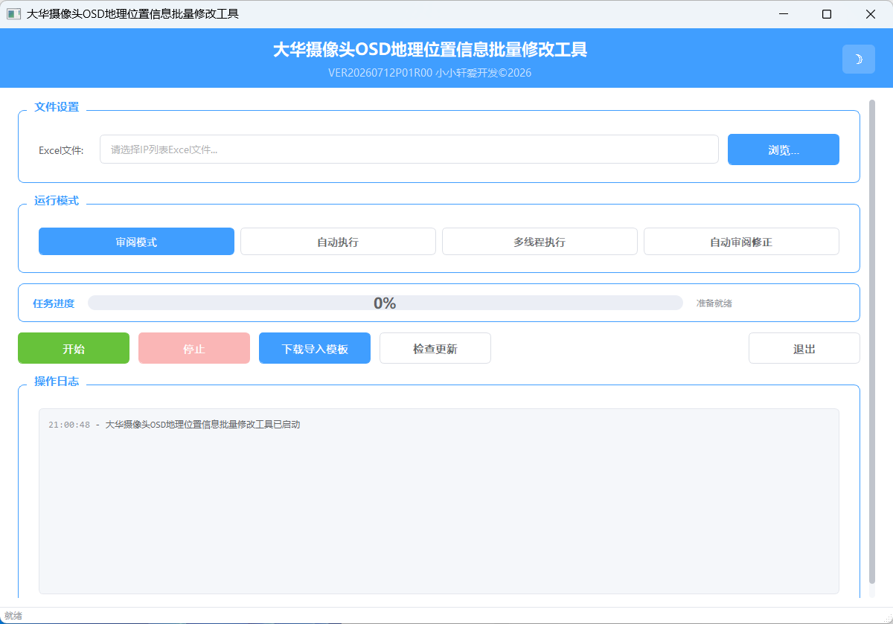
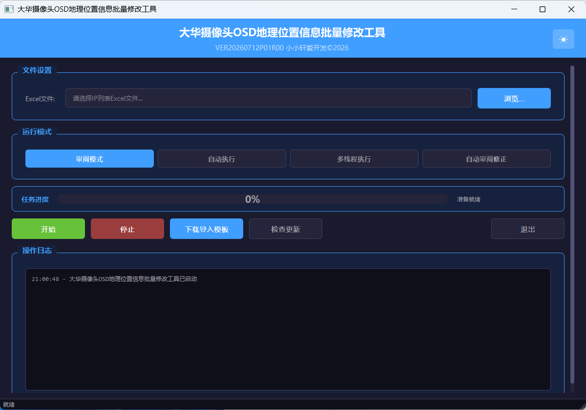

# 大华摄像头OSD地理位置信息批量修改工具

用于批量对大华（Dahua）摄像头的视频叠加（OSD）地理位置信息进行读取、写入与自动修正的桌面工具，支持 Excel 批量导入设备清单并将执行/检查结果回写至 Excel 文件。

## 功能介绍

- **四种运行模式**
  - **审阅模式**：仅自动登录并打开每台设备的「视频叠加 → 地理位置」页面，不写入任何数据，供人工检查
  - **自动执行**：自动登录设备并将 Excel 中的地理位置信息与对齐方式写入 OSD 配置
  - **多线程执行**：多浏览器并发写入，可自定义并发线程数（1~10），大幅提升批量处理效率
  - **自动审阅修正**：自动对比设备当前 OSD 配置与期望值，不一致则自动修正并复检，结果标记为「正确 / 不正确已修正 / 修正失败需人工检查」
- **Excel 批量导入**：从 `list.xlsx` 读取设备 IP、账号、密码及 D~H 列地理位置信息（按倒序对应输入框），I 列为对齐方式（左对齐 / 右对齐）
- **结果回写**：执行结果写入 Excel 第 J 列，审阅修正结果写入第 K 列；若原文件被占用，自动另存为 `xxx_结果.xlsx`（冲突时追加时间戳）
- **失败自动重试**：单台设备执行失败会自动刷新页面重试一次；多线程模式下失败设备会统一进入独立的重试线程再次处理
- **模板下载**：一键导出导入模板 `list.xlsx`，规范输入格式
- **亮色/暗色主题**：提供两套完整界面主题，可随时切换
- **实时进度与日志**：自定义进度条 + 操作日志窗口，任务完成弹出汇总对话框（成功/失败/修正统计）
- **中途停止**：任务执行过程中可随时点击「停止」终止处理
- **检查更新**：连接 GitHub Releases 比对版本号，发现新版本可一键跳转下载
- **便携版 Chrome**：内置便携版 Chrome 浏览器与 chromedriver，无需用户额外安装浏览器环境
- **高 DPI 适配**：启用高分屏缩放与高清图标，界面清晰不模糊

## 运行环境

- 操作系统：Windows 10 及以上
- 内存：建议 4GB 及以上

## 使用方法

直接运行 `DH_OSD_Modify.exe` 即可。

### 操作流程

1. 启动程序
2. 点击「下载导入模板」获取 `list.xlsx`，按列填入设备 IP、账号、密码、地理位置信息（D~H）与对齐方式（I）
3. 点击「浏览」选择填好的 Excel 文件
4. 根据需求选择运行模式（审阅 / 自动执行 / 多线程执行 / 自动审阅修正）；多线程模式需设置并发线程数（建议 2~5）
5. 点击「开始」执行，浏览器将自动登录各设备并操作 OSD 配置
6. 处理过程中可随时「停止」；完成后查看 Excel 第 J / K 列结果及弹出的汇总提示

### 列说明（list.xlsx）

| 列 | 字段 | 说明 |
|----|------|------|
| A | IP | 摄像头管理地址（必填） |
| B | 账号 | 登录用户名（必填） |
| C | 密码 | 登录密码（必填） |
| D~H | 地理位置 | 共 5 项，按倒序对应 OSD 输入框 |
| I | 对齐方式 | 填写「左对齐」或「右对齐」 |
| J | 执行结果 | 程序回写（成功 / 失败） |
| K | 检查结果 | 程序回写（自动审阅修正模式） |

## 注意事项

- 单次处理不建议设备数量过多，建议分批处理
- 首次运行需等待便携版 Chrome 解压，请耐心等待
- 多线程模式下并发数量不宜过多，否则可能导致系统卡顿或设备响应异常（建议 2~5 个）
- 程序运行日志保存在同目录的 `run.log` 中，便于排查异常

## 运行截图

